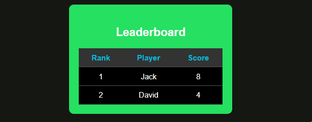
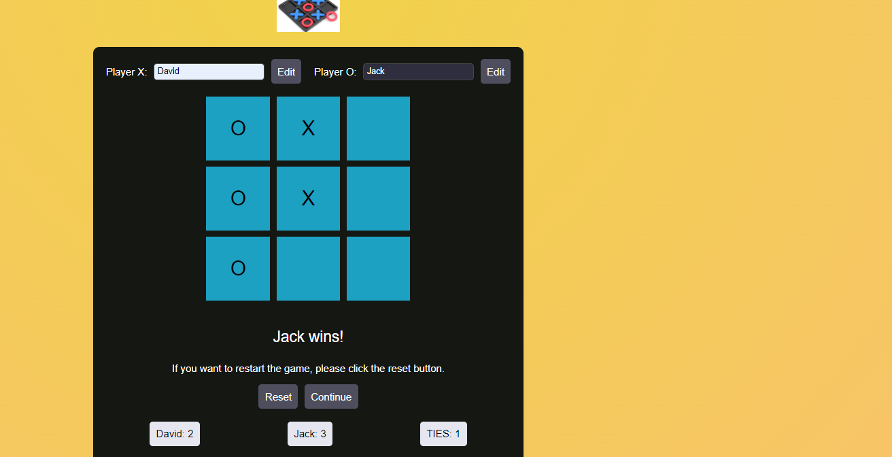
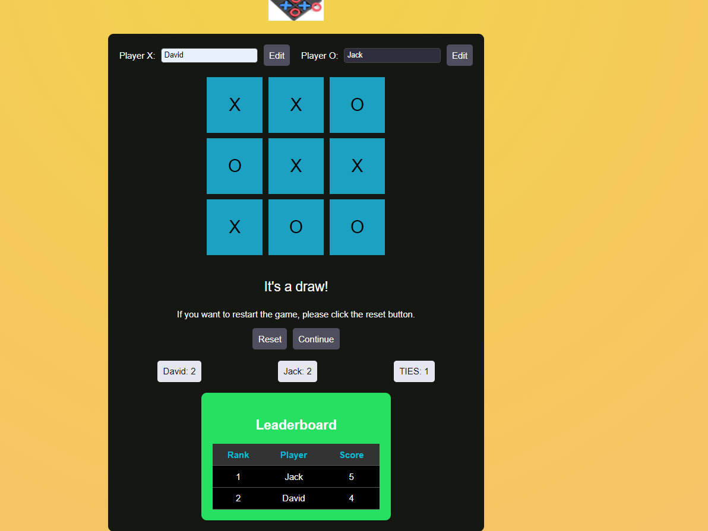
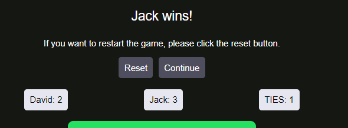

# Tic Tac Toe Game

## Overview
This is a web-based Tic Tac Toe game that allows two players to compete against each other. The game keeps track of scores, ties, and displays a leaderboard. Players can edit their names, and the game status is updated dynamically. If a player wins or the game ends in a draw, appropriate messages are displayed.

## Features
- Two-player Tic Tac Toe game
- Editable player names
- Dynamic score tracking
- Leaderboard with ranking based on scores
- Continue and reset game options

## How to Play
1. **Start the Game**: The game starts with Player X's turn.
2. **Make a Move**: Players take turns clicking on cells to make their move.
3. **Win or Draw**: The game ends when a player wins or all cells are filled, resulting in a draw.
4. **Continue or Reset**: After the game ends, players can choose to continue or reset the game.

### Leaderboard

The leaderboard shows the ranking of players based on their scores.

### Name Edit

Players can edit their names by clicking the "Edit" button next to their name.

### Game Status - Player Wins

When a player wins, a message is displayed indicating the winner.

### Game Status - Draw

If the game ends in a draw, a message is displayed indicating the draw.

### Player stats 

the stats of each player

